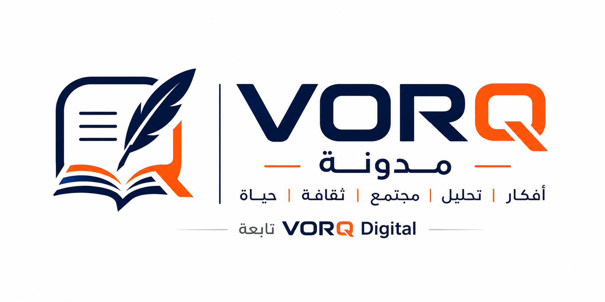

# VORQ-DIGITAL-INFO.md

**Project:** VORQ Blog / VORQ Digital  
**Version:** VD-BLOG-2026-05-26-22-00-Europe-Berlin  
**Last reviewed:** 2026-05-26 22:00 Europe/Berlin  
**Status:** current-reviewed  

# VORQ-DIGITAL-INFO

**Project:** VORQ Digital / VORQ Blog / VORQ Fordon / future VORQ projects  
**Status:** living reference file — do not go backward  
**Last updated:** 2026-05-26 22:00 Europe/Berlin  
**Current reference version:** VD-BLOG-2026-05-26-22-00-Europe-Berlin

---

## 1. Purpose of this file

This file is the main reference for all VORQ Digital projects. It replaces the older project-specific reference name **VORQ-FORDON-INFO** and expands it into a general reference for:

- **VORQ Digital** as the umbrella/business identity;
- **VORQ Blog** as the Arabic blog/content platform;
- **VORQ Fordon** as the vehicle-ad platform directed to the Swedish market;
- future VORQ pages, apps, services, and sub-projects.

Before editing any project file, compare it with this reference. If a file contradicts this document, treat that file as old or unsafe until reviewed.

---

## 2. Approved umbrella identity

### Approved umbrella / business brand

**VORQ Digital**

### Correct legal operator wording

Use one of these forms in legal pages, account pages, contracts, terms, privacy pages, footers, and official communication:

- **VORQ Digital, Inhaber: Haitham Kojar**
- **Haitham Kojar – VORQ Digital**

Do **not** use **VORQ Digital** alone in legal pages, invoices, contracts, privacy pages, terms, or official legal emails.

### Legal address

**Ziegelstraße 26, 42289 Wuppertal, Deutschland**

### Official contact phone

**0178-3705133**  
Phone calls are available in Arabic only. Written legal, privacy, copyright, security, and content reports should preferably be sent by email to **info@vorq.group** for documentation.

### Legal form

**nicht eingetragenes gewerbliches Einzelunternehmen**

### Registered activity

**IT-Dienstleistungen, Webdesign, Webentwicklung und Betrieb von Internetportalen**

### Important legal identity note

VORQ Digital is the business/umbrella brand for the projects. The legal operator is the individual German sole proprietorship:

**Haitham Kojar – VORQ Digital**

The business is not a registered limited company and must not be described as a separate incorporated company unless this changes later.

---

## 3. Approved projects under VORQ Digital

### 3.1 VORQ Blog

**Project type:** Arabic blog / articles / analysis / ideas platform  
**Current language decision:** Arabic-only interface and Arabic-focused content for the current stage.  
**Future option:** foreign-language content or interfaces may be added later only after a planned update.

**Approved description:**

> VORQ Blog هي مدونة عربية تابعة لـ VORQ Digital، تنشر مقالات وأفكاراً وتحليلات حول المجتمع والاقتصاد والسياسة والأسرة والحياة والثقافة والتكنولوجيا.

**Important:**

- The homepage should currently show Arabic-only language direction.
- Remove foreign language selectors from the public blog interface and writer publishing form for now.
- Existing database posts may contain a `lang` field, but the current public interface should show Arabic posts only.
- The blog is not a formal news agency, government body, medical/legal/financial advisory service, or official journalism institution.
- Writer opinions belong to the writer unless clearly stated otherwise.

### 3.2 VORQ Fordon

**Project type:** vehicle advertising / vehicle classifieds platform  
**Market focus:** directed to the Swedish market  
**Approved description:**

> VORQ Fordon är en fordonsannonsplattform riktad till den svenska marknaden.

VORQ Fordon must not be described as a Swedish legal company/entity.

### 3.3 Future projects

Future projects may use their own project names, but legal/operator wording should remain aligned with this file unless the legal structure changes.

---

## 4. Branding and logo decisions

### Umbrella logo

Use `vorq-digital-logo.svg` for VORQ Digital umbrella pages or when a project-specific logo is not available.

### VORQ Blog logo

The latest approved concept for VORQ Blog is the blog-specific logo with VORQ identity, writing/book symbolism, and Arabic-friendly design.

Recommended production filename:

```text
vorq-blog-logo.png
```

For pages already updated, use:

```html

```

This keeps the page functional if the blog logo is not uploaded yet.

### VORQ Fordon logo

Current approved header logo file:

```text
vorq-fordon-logo-header.png
```

### Old visible branding to remove

Do not use visible old project/brand names unless they are unavoidable Firebase technical identifiers:

- `BILHK`
- `BilMarknad`
- `HK Global`
- `VORQ Digital` in the new Blog/Digital legal and public pages
- old Swedish address `Ziegelstraße 26, 42289 Wuppertal, Deutschland` for VORQ Blog legal pages

---

## 5. Legal and liability position — VORQ Blog

VORQ Blog is a content/blog platform, not an official news agency or professional advisory service.

The platform should state clearly that:

- it publishes general Arabic articles, opinions, and analysis;
- writer content reflects the writer’s responsibility;
- content does not replace official sources or professional advice;
- medical, legal, financial, investment, psychological, or professional topics are general information only;
- readers should verify important information through official or specialized sources;
- external links are not guaranteed by VORQ Blog;
- the operator may review, hide, edit, or delete content that creates legal, safety, copyright, privacy, or moderation risk.

### Writer responsibility

Writer accounts must continue to store proof that the writer accepted:

- Writer Responsibility Agreement;
- Terms of Use;
- Privacy Policy;
- Disclaimer.

Recommended fields for Realtime Database writer profiles:

- `uid`
- `name`
- `email`
- `role: "employee"`
- `displayRole: "writer"`
- `active: true`
- `inviteKey`
- `acceptedTerms: true`
- `termsVersion`
- `privacyVersion`
- `contractVersion`
- `disclaimerVersion`
- `acceptedAt`
- `operatorLegalName`
- `operatorAddress`
- `legalForm`
- `registeredActivity`
- `projectName: "VORQ Blog"`
- `projectLanguage: "Arabic"`

---

## 6. Legal and liability position — VORQ Fordon

VORQ Fordon is a technical advertising intermediary only.

The platform must state clearly that it:

- does not sell vehicles;
- does not own vehicles;
- does not inspect vehicles;
- does not store vehicles;
- does not guarantee vehicles;
- does not control the truth of user ad content;
- does not act as seller, buyer, broker, payment provider, inspection body, or warranty provider.

Advertisers/users are responsible for ad content, photos, price, condition, contact details, and legality.

---

## 7. Required legal pages by project

### VORQ Blog

The blog should contain and link to:

- `terms.html`
- `privacy.html`
- `disclaimer.html`
- `legal.html`
- `employee-contract.html`
- `hk-writers-access.html` as private writers portal, not public navigation
- `employee-register.html` as invitation-only writer registration
- `admin.html` as private admin page
- `create-post.html` as private writer/admin publishing page
- `manage-posts.html` as private writer/admin management page
- `404.html`

### VORQ Fordon

The vehicle platform should contain and link to:

- `terms.html`
- `privacy.html`
- `cookies.html`
- `legal.html`
- `foretagsinfo.html`
- `impressum.html`
- `notice-action.html`
- `rapportera.html` where kept as a reporting/support alias
- `404.html`
- `offline.html`

---

## 8. Firebase and technical identifiers

### VORQ Blog Firebase project

The blog files currently use the Firebase technical project:

```js
projectId: "hk-blog-3ed96"
authDomain: "hk-blog-3ed96.firebaseapp.com"
databaseURL: "https://hk-blog-3ed96-default-rtdb.europe-west1.firebasedatabase.app"
storageBucket: "hk-blog-3ed96.firebasestorage.app"
```

These Firebase identifiers may remain as backend technical identifiers. They are not the public brand.

### VORQ Fordon Firebase project

VORQ Fordon may still use technical identifiers such as:

```text
bilmarknad-hk
bilmarknad-hk.web.app
bilmarknad-hk.firebaseapp.com
projectId: "bilmarknad-hk"
```

Do not change Firebase project IDs unless an intentional Firebase migration is performed.

---

## 9. Security coding rules

### Avoid unsafe HTML insertion

Avoid `innerHTML` unless absolutely necessary and fully controlled.

Preferred:

- `textContent`
- `replaceChildren()`
- `createElement()`
- `append()` / `appendChild()`
- `setAttribute()`

If HTML must be inserted, sanitize or escape all dynamic values.

### Frontend code cannot be truly encrypted

HTML, CSS, and browser JavaScript cannot be truly hidden from visitors. Frontend obfuscation or minification can slow copying, but it is not real security.

Real protection must come from:

- Firebase Authentication;
- Firebase Realtime Database / Firestore / Storage Rules;
- not exposing secret keys or Admin SDK credentials;
- security headers;
- HTTPS;
- strict validation;
- minimizing unsafe DOM insertion;
- private admin/writer pages with `noindex` and authentication checks.

### Never publish secrets

Never publish:

- `.env`
- service account JSON
- Admin SDK private keys
- private certificates
- API secrets meant for a server only
- passwords
- private tokens

Firebase web config is not a secret by itself, but security must be enforced through Firebase Rules.

---

## 10. Firebase Hosting security headers

`firebase.json` should keep private/admin pages unindexed and add reasonable security headers, including where applicable:

- `X-Robots-Tag: noindex, nofollow` for admin/writer/private pages;
- `X-Content-Type-Options: nosniff`;
- `Referrer-Policy`;
- `Permissions-Policy`;
- `X-Frame-Options` or CSP `frame-ancestors` if compatible;
- a careful `Content-Security-Policy` that does not break Firebase CDN imports.

Do not deploy `VORQ-DIGITAL-INFO.md` publicly.

---

## 11. Mandatory version header rule

Every file modified from now on must include a version marker near the top.

This prevents returning to old files.

### Required fields

- File name
- Project
- Version
- Last updated date
- Last updated time with timezone
- Status
- Change note

### Recommended timestamp format

```text
2026-05-26 18:45 Europe/Berlin
```

### HTML / MD files

```html

```

### JS / CSS / rules files

```js

```

### JSON / webmanifest files

JSON does not allow comments. Do not add invalid comments. Use metadata only if the specific JSON consumer safely tolerates it. For `firebase.json`, avoid extra unknown top-level metadata if it risks deploy compatibility.

---

## 12. Files reviewed / modified in current Blog cycle

Current updated files:

- `404.html` — updated to VORQ Blog / VORQ Digital identity and German legal operator data.
- `admin.html` — updated to VORQ Digital identity and current admin wording.
- `create-post.html` — updated to Arabic-only publishing, VORQ Digital identity, and safer preview image handling.
- `disclaimer.html` — updated to VORQ Digital legal operator data and stronger liability wording.
- `employee-contract.html` — updated writer responsibility agreement with German legal operator data.
- `employee-register.html` — updated invitation-only writer registration, Arabic-only Blog decision, and stronger acceptance proof fields.
- `firebase.json` — updated hosting/security headers and noindex handling for private pages.
- `hk-writers-access.html` — updated private writers portal identity, legal operator data, and safe DOM handling.
- `index.html` — updated public homepage to Arabic-only blog direction, VORQ Digital identity, German operator data, blog logo path with fallback, and safer DOM rendering.
- `VORQ-DIGITAL-INFO.md` — updated as living reference after each reviewed file.

Pending from uploaded batch:

- `legal.html`

Additional project files may still need upload/review if they exist, such as:

- `terms.html`
- `privacy.html`
- `manage-posts.html`
- `app.js`
- database rules files
- storage rules files
- service worker / manifest files if used for the blog

---

## 13. Current do-not-go-back checklist

Before uploading or editing any file, check:

- Does the file contain a current version header?
- Does it use **VORQ Blog** for the blog project?
- Does it use **VORQ Digital** as umbrella identity?
- Does legal wording use **VORQ Digital, Inhaber: Haitham Kojar** or **Haitham Kojar – VORQ Digital**?
- Does it use the German address **Ziegelstraße 26, 42289 Wuppertal, Deutschland**?
- Has old visible **VORQ Digital** wording been removed from updated Blog files?
- Has the old Swedish address been removed from updated Blog legal pages?
- Is the Blog interface Arabic-only for now?
- Are foreign-language selectors removed from current Blog UI unless intentionally reintroduced later?
- Are private pages marked `noindex, nofollow`?
- Does the code avoid unsafe `innerHTML` for dynamic content?
- Are writer/admin actions protected by Firebase Authentication and Database Rules?
- Are legal pages linked correctly?
- Are secrets excluded from hosting and repository deployment?
- Is `VORQ-DIGITAL-INFO.md` kept as internal reference and not publicly deployed?

---

## 14. Latest operational note

As of this version, the VORQ Blog review is moving file-by-file. The public homepage has now been aligned with the Arabic-only direction and updated to safer DOM construction. The next uploaded file to review is `legal.html` unless new files are provided.


---

## Privacy page public wording fix — 2026-05-26 20:48 Europe/Berlin

`privacy.html` was corrected because the public page displayed internal technical implementation details, including database path names and a technical explanation of the writer path naming. The updated public privacy text now uses general wording: technical services for login, writer account management, article storage, private page protection, and hosting. Internal database path names should remain only in project references, code, rules, and developer documentation, not in visitor-facing legal pages.

Current rule: public legal/privacy pages may name categories of service providers and purposes of processing, but should not expose internal route/path names such as admin/user/post database paths unless legally necessary.

## Update 2026-05-26 — Visible legal-draft warnings removed

Public pages must not display internal wording such as “template”, “not final legal advice”, or “review by specialist before commercial launch”. These reminders may stay only in internal project notes. Public-facing pages should instead show stable legal/operator information and, where useful, neutral wording such as: “This page may be updated when operator details, services, or processing scope change.”

Affected public/legal files cleaned in this update: `privacy.html`, `terms.html`, `legal.html`, `disclaimer.html`, and `employee-contract.html`.
## JSON/config safety note - 2026-05-26 21:38 Europe/Berlin

`firebase.json` and `realtime-database-rules.json` are kept as valid deployable configuration files without comment blocks or extra metadata fields. Version information is tracked here instead to avoid breaking Firebase tooling.


## آخر تحديث - تنبيه التشغيل التجريبي
- تم إضافة تنبيه عربي قصير في هيدر الصفحة الرئيسية: الموقع في مرحلة التشغيل التجريبي وقد يتم تعديل المحتوى والصفحات قبل الإطلاق النهائي.
- رابط البلاغات والبريد الرسمي يظهران في التنبيه لتوجيه المستخدمين عند وجود خطأ أو محتوى يحتاج مراجعة.
- تم الحفاظ على رابط Impressum ورقم الهاتف الرسمي 0178-3705133 مع ملاحظة أن المكالمات الهاتفية باللغة العربية فقط.
